# Readme

This instructions will help you install prerequisites components to work with Arduino Releaf dongle

## Setup dependencies

1. Go to Arduino website to install Arduino IDE

    `https://www.arduino.cc/en/software`

2. Install Legacy IDE `v 1.8.X` (highiest version)

    `Arduino`

3. Install version for you OS (Windows 7 +)

    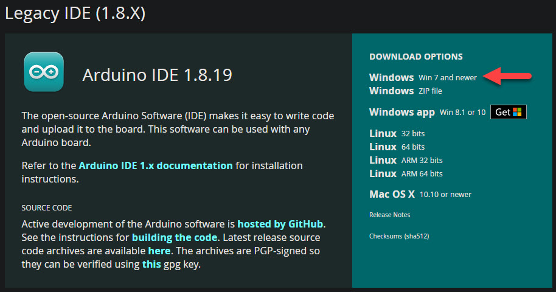

4. Start the installer and follow steps to install USB Driver and Arduino IDE.

    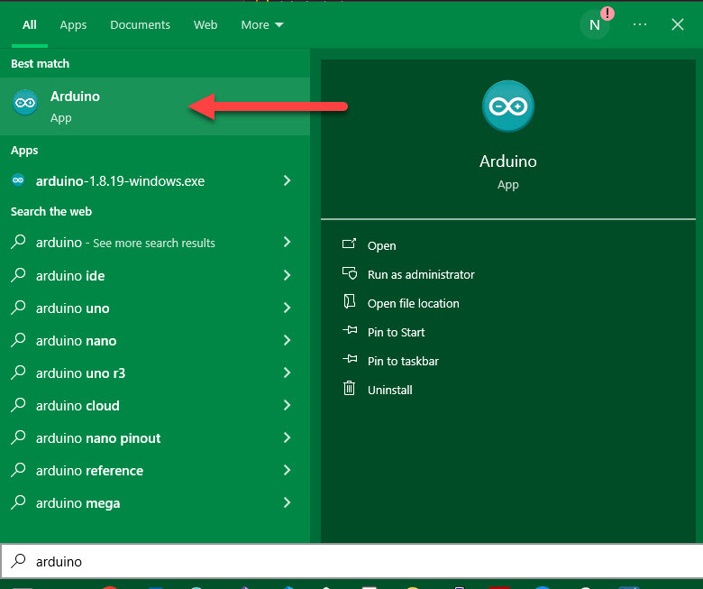

5. Accept firewall for Arduino IDE

    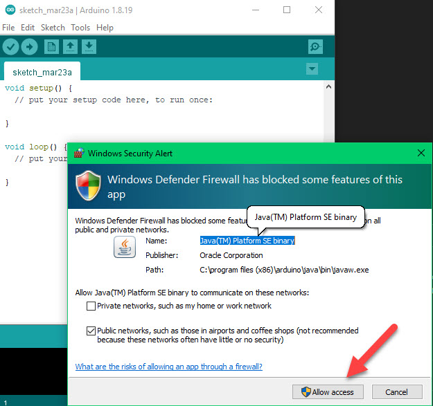

6. Open project

    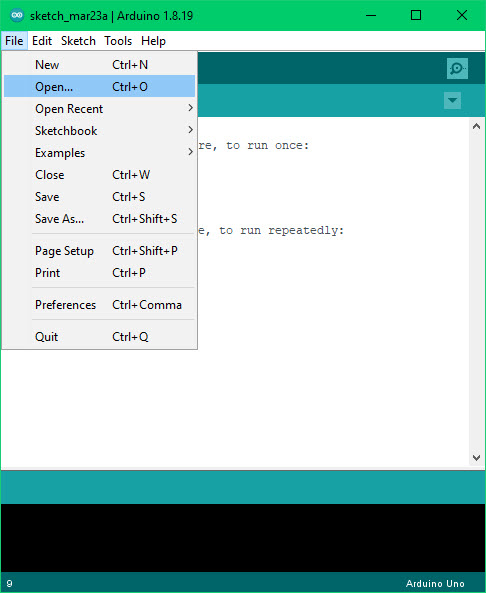

7. Then open project in path:

    `./apps\gen-parker\hardware\philanthropy-arduino.ino\philanthropy-arduino.ino.ino`

    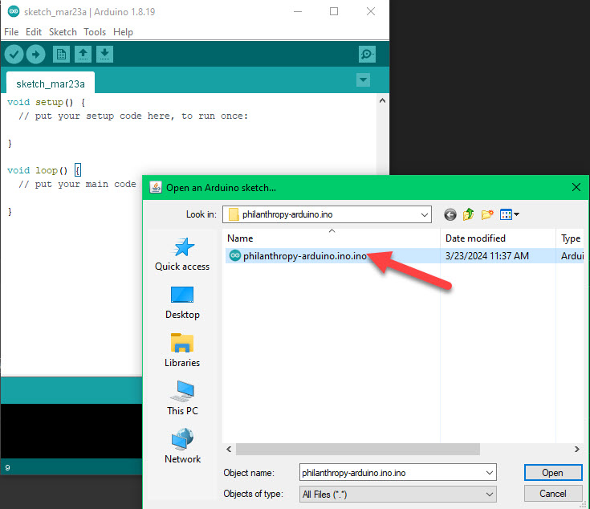

## Install dependencies

Some sensor need specific dependencies

1. Install DHT_U library from Adafruit.

**With Library Manager:**

  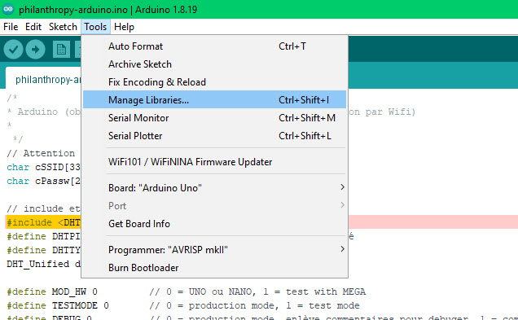
  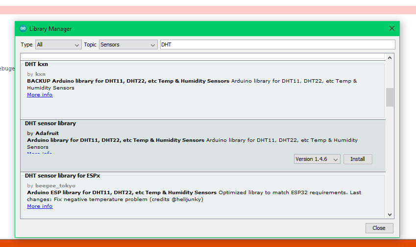
  

**Manually:**

- https://www.arduino.cc/reference/en/libraries/dht-sensor-library/
- https://github.com/adafruit/Adafruit_DHT_Unified

## Setup hardware

**Hardware description**

  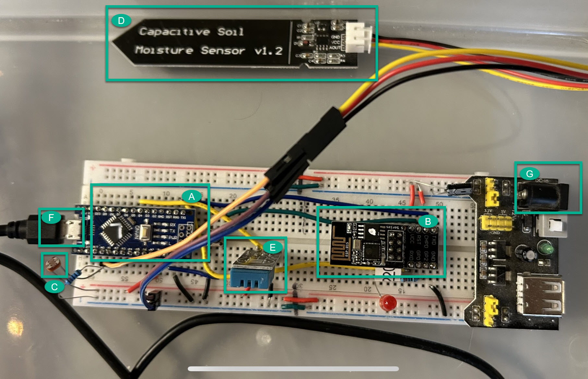

  a. Arduino dongle: used to coordonation other dongles (🧠 brain)

  b. Wifi dongle: used to communicate with server

  c. Luminosity sensor: used to get light info

  d. Moisture sensor: used to get moisture info

  e. Temperature sensor: used to get temperature info

  f. Usb cable: used to upload new code and debug. (IMPORTANT: don't use with power cable)

  g. Power cable: used when releaf hardware is used in autonomus mode (IMPORTANT: don't use with usb cable)

**steps**

1. Connect USB Cable (without Power Cable) to connect with Arduino IDE. See part `f)`

2. Choose Arduino version: `Arduino Nano`

3. Choose Processor: `ATmega328P (Old Bootloader)`

4. Choose Port: `COM3` (can be another on your computer)

    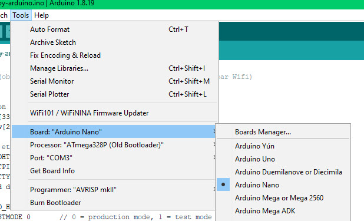

5. Change Wifi credentials for tests

    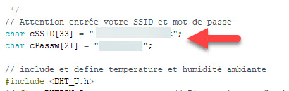

## Upload new code

NOTE: USB Cable upload is NOT available when Wifi dongle is running. Serial port of Arduino Nano is used to communicate from component A) to B).

To be able to run new code:

1. Unplug Wifi dongle

    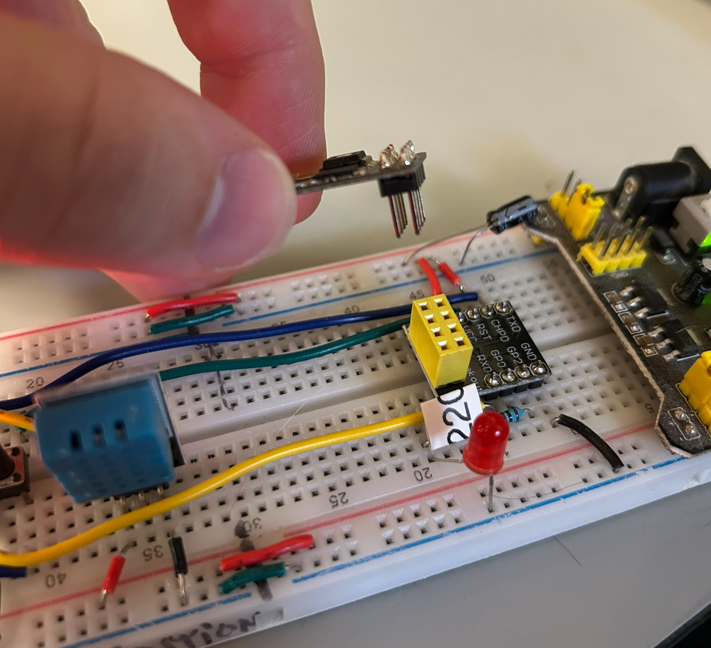

2. Upload code

    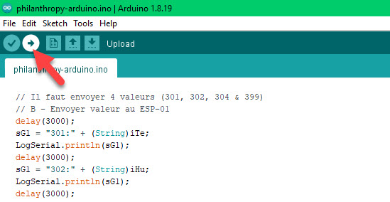

3. Reconnect Wifi dongle

## Setup VS Code intellisense

1. Install "Arduino" VS Code Extention

    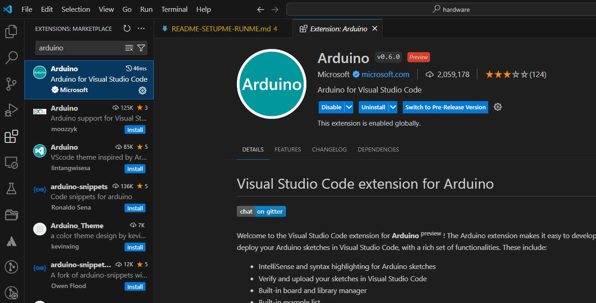

2. Add `include path` to load dependencies definition

    > note: paths may vary depending on your setup
    >
    > install libraries
    > - [user path]/Documents/Arduino/libraries/**",
    >
    > arduino standard library
    > - C:/Program Files (x86)/Arduino/**

    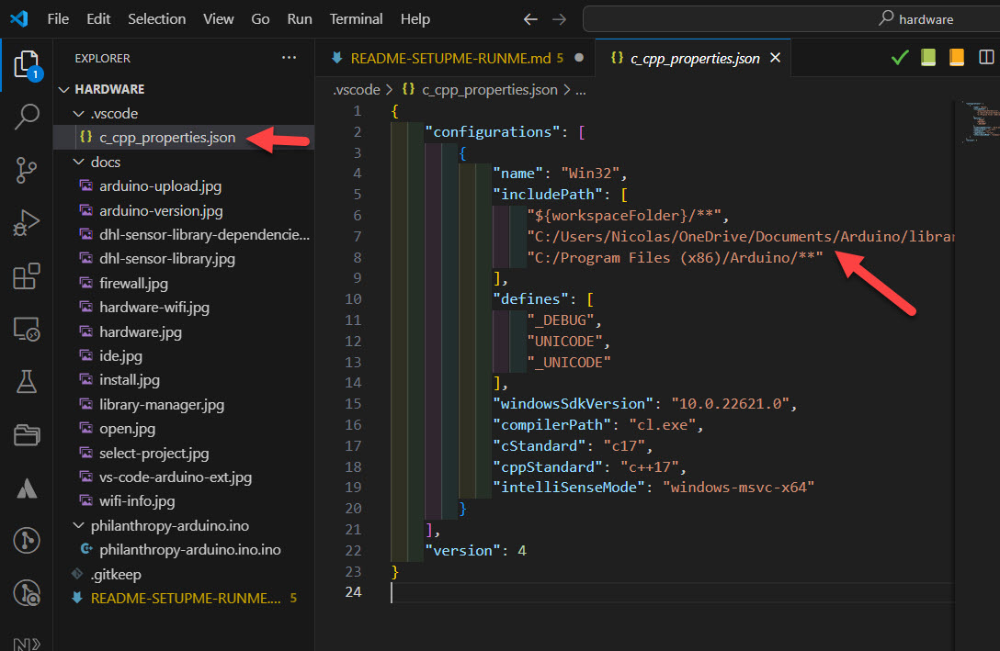
